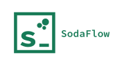

<div class="sf-hero">

<p class="sf-hero-tagline">Functional Reactive Programming for .NET.</p>
<p class="sf-hero-lede">Two composable primitives: a <strong>stream</strong> of discrete events, and a <strong>cell</strong> holding a value over time. A transaction system updates everything you build from them <em>atomically</em>, so no observer ever sees a half-updated graph or a value that never logically existed. In C# and F#.</p>
<p class="sf-actions">
<a class="sf-button sf-button-primary" href="docs/getting-started.md">Get started</a>
<a class="sf-button" href="docs/concepts.md">Core concepts</a>
<a class="sf-button" href="api/index.md">API reference</a>
</p>
</div>

```csharp
StreamSink<int> s = Stream.CreateSink<int>();
Cell<int> c = s.Hold(0);
IListener l = c.Listen(Console.WriteLine);

s.Send(2);   // prints 2
s.Send(9);   // prints 9

l.Unlisten();
```

SodaFlow is based on [Sodium](https://github.com/SodiumFRP/sodium), the Functional Reactive
Programming library by Stephen Blackheath and Anthony Jones, and began as that project's .NET
implementation. The model documented here is Sodium's: streams, cells, behaviors, transactions,
and the [denotational semantics](docs/semantics.md) that SodaFlow implements unchanged. The
credit for that model belongs upstream. Sodium's implementations for Java, Scala, C++, Kotlin,
TypeScript, and Rust live under the
[SodiumFRP organization](https://github.com/SodiumFRP).

## Start here

<div class="sf-cards">
<a class="sf-card" href="docs/getting-started.md">
<i class="bi bi-play-circle"></i>
<span class="sf-card-title">Getting started</span>
<span class="sf-card-text">Install a package and run your first program.</span>
</a>
<a class="sf-card" href="docs/packages.md">
<i class="bi bi-box-seam"></i>
<span class="sf-card-title">Which package do I install?</span>
<span class="sf-card-text">This page picks one of the published packages for you.</span>
</a>
<a class="sf-card" href="docs/concepts.md">
<i class="bi bi-diagram-3"></i>
<span class="sf-card-title">Core concepts</span>
<span class="sf-card-text">Streams, cells, behaviors, and transactions.</span>
</a>
<a class="sf-card" href="docs/operations.md">
<i class="bi bi-list-columns"></i>
<span class="sf-card-title">Operation reference</span>
<span class="sf-card-text">Every operation, C# and F# side by side.</span>
</a>
<a class="sf-card" href="docs/cookbook.md">
<i class="bi bi-journal-code"></i>
<span class="sf-card-title">Cookbook</span>
<span class="sf-card-text">Recipes for the things that come up constantly.</span>
</a>
<a class="sf-card" href="docs/samples.md">
<i class="bi bi-window-stack"></i>
<span class="sf-card-title">Sample applications</span>
<span class="sf-card-text">Full WPF and Avalonia apps over shared view models.</span>
</a>
<a class="sf-card" href="api/index.md">
<i class="bi bi-braces"></i>
<span class="sf-card-title">API reference</span>
<span class="sf-card-text">Generated from the source.</span>
</a>
</div>

## Going deeper

<div class="sf-cards">
<a class="sf-card" href="docs/transactions.md">
<i class="bi bi-shield-check"></i>
<span class="sf-card-title">Transactions</span>
<span class="sf-card-text">Atomicity, simultaneity, and why glitches cannot happen.</span>
</a>
<a class="sf-card" href="docs/loops.md">
<i class="bi bi-arrow-repeat"></i>
<span class="sf-card-title">Feedback loops</span>
<span class="sf-card-text">Values that depend on their own past.</span>
</a>
<a class="sf-card" href="docs/switch.md">
<i class="bi bi-shuffle"></i>
<span class="sf-card-title">Switch and dynamic graphs</span>
<span class="sf-card-text">Changing the graph's shape at runtime.</span>
</a>
<a class="sf-card" href="docs/lifetimes.md">
<i class="bi bi-hourglass-split"></i>
<span class="sf-card-title">Listener lifetimes</span>
<span class="sf-card-text">The most common way to break a SodaFlow program.</span>
</a>
<a class="sf-card" href="docs/time.md">
<i class="bi bi-clock"></i>
<span class="sf-card-title">Time and timers</span>
<span class="sf-card-text">Clocks, alarms, and deterministic tests.</span>
</a>
<a class="sf-card" href="docs/async.md">
<i class="bi bi-lightning-charge"></i>
<span class="sf-card-title">Asynchronous work</span>
<span class="sf-card-text">Running tasks without breaking the model.</span>
</a>
<a class="sf-card" href="docs/collections.md">
<i class="bi bi-collection"></i>
<span class="sf-card-title">Reactive collections</span>
<span class="sf-card-text">Large keyed collections where an edit reaches only the rows bound to it.</span>
</a>
<a class="sf-card" href="docs/bindable.md">
<i class="bi bi-ui-checks-grid"></i>
<span class="sf-card-title">Data binding</span>
<span class="sf-card-text">Exposing a graph to XAML as properties and commands.</span>
</a>
<a class="sf-card" href="docs/semantics.md">
<i class="bi bi-calculator"></i>
<span class="sf-card-title">Denotational semantics</span>
<span class="sf-card-text">Sodium's formal specification, which SodaFlow is tested against.</span>
</a>
</div>

## Elsewhere

- **Book** — [*Functional Reactive Programming*](https://www.manning.com/books/functional-reactive-programming)
  (Blackheath & Jones, Manning) is the best reference for both the Sodium model SodaFlow is
  built on and for Functional Reactive Programming in general. Almost everything it teaches
  applies directly here. Its worked examples live in
  [`book/`](https://github.com/SodiumFRP/sodium/tree/master/book) in C#, F#, and Java.
- **Issues** — <https://github.com/MorseCode-Software/SodaFlow/issues>
- **Sodium** — the upstream project SodaFlow is based on:
  <https://github.com/SodiumFRP/sodium>. Its user forum, which covers the shared model rather
  than SodaFlow specifically, is at <https://sodiumfrp.discourse.group/>.
